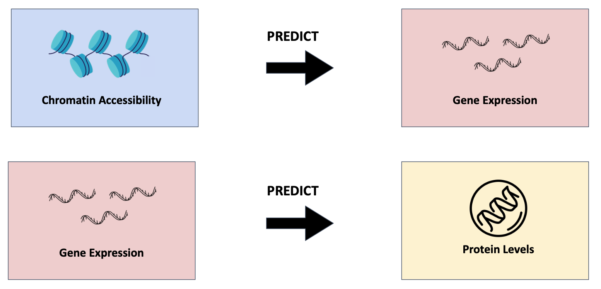

# 2023 SBDS Hackathon
## Overview
Welcome, to the 2023 Systems Biology and Data Science (SBDS) Hackathon. This is a 48-hour hackathon working to tackle open problems in single-cell analysis. The goal of this competition is to predict how DNA, RNA, and protein measurements co-vary in single cells as bone marrow stem cells develop into more mature blood cells. You will develop a model trained on a subset of 300,000-cell time course dataset of CD34+ hematopoietic stem and progenitor cells (HSPC) from four human donors at five time points generated for this competition by Cellarity, a cell-centric drug creation company. 

## The challenge
There are two main challenges for this hackathon. Both challenges must be achieved through machine learning and data science approaches. First, you must train a model that can utilize chromatin accessibility data to predict gene expression data _from the same cell_. More speficially, you must convert each row of a scATAC-seq dataset into a corresponding row of a scRNA-seq dataset. The second challenge is to convert gene expression data into protein level data. Specifically, you must convert each row of a scRNA-seq dataset into a correspodning row of a CITE-seq dataset (Fig. 1).

As mentioned, these tasks must be solved through machine learning and data science approaches. Anything is fair game including libraries, packages, or even previously built models to solve these challenges!

## The data
The data for this competition lives inside `/data`. There are three main datatypes you will be working with:
1. Chromatin accessibility (scATAC-seq)
2. Gene expression (scRNA-seq)
3. Protein levels (CITE-seq)

These three datasets were obtained from single-cell multiomics data collected from mobilized peripheral CD34+ hematopoietic stem and progenitor cells (HSPCs) isolated from four healthy human donors. This data was collected repeatedly over the course of many days (Fig. 2)

Each task mentioned [above](#the-challenge) works with two of the three datatypes. Task one works with scATAC-seq (input) + scRNA-seq (output), while task two works with scRNA-seq (input)  + scCITE-seq (output). As such, the tasks can be conceptualized as such:

**Task 1:** Train a model with `train_multi_inputs.h5` (scATAC-seq) as input and `train_multi_targets.h5` (scRNA-seq) as output. Test your model with `test_multi_inputs.h5`.  
**Task 2:** Train a model with `train_cite_inputs.h5` (scRNA-seq) as input and `train_cite_targets.h5` (scCITE-seq) as output. Test your model with `test_cite_targets.h5`.

